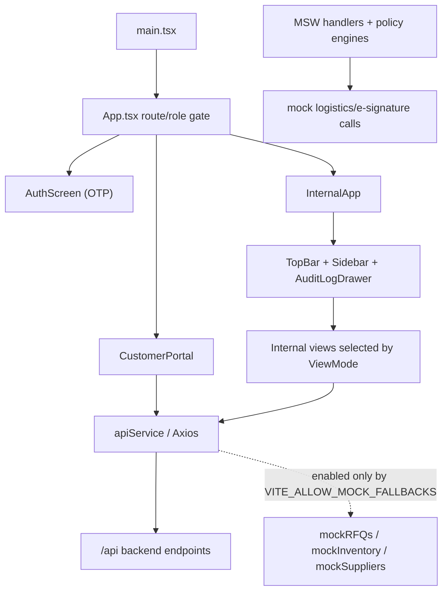

# UI Architecture Reference

## Scope & Runtime Boundary

This reference covers every file under `frontend/src` as inspected on 2026-09-22 (26 files). The Vite React 18 application has two routes:

- **Customer portal:** `/`, `/portal`, and `/customer-portal`; it requires a customer OTP session and renders `CustomerPortal`.
- **Internal command center:** `/internal`, or a stored internal role; it requires an internal OTP session and renders `InternalApp` with state-selected views rather than a client-side router.

`apiService` uses `/api` locally and the configured or Render API host in production. It attaches the access token from `localStorage`, applies a 10-second Axios timeout, and permits in-memory fallback data only when `VITE_ALLOW_MOCK_FALLBACKS=true`. The production decision record identifies this Vite application as an internal/development surface; `apps/web` is selected as the public production customer frontend.

## Application Composition & Data Flow

## Customer-Facing Views

| Component / path | Purpose & controls | Data, API, and state connections | Functional status |
| --- | --- | --- | --- |
| `CustomerPortal` — `frontend/src/components/views/CustomerPortal.tsx` | Public customer workspace: catalog search, RFQ submission, PO submission, private-token shipment tracking, and a support mail link. Result cards prefill the RFQ part number; the compliance checkbox gates RFQ submit. | Local form/search/tracking state. Calls `searchCatalog`, `submitCustomerRFQ`, `submitPurchaseOrder`, and `trackShipment`; refreshes a loaded shipment every minute. The selected PDF file is retained only as its filename and is never uploaded. | **Partially live.** API-backed flows and loading/error states exist; compliance-file selection and post-submit “Processing Autonomous Fulfillment” are visual-only. |
| `CustomerDashboard` — `frontend/src/components/views/CustomerDashboard.tsx` | Authenticated customer operations UI: quote/RFQ list and sourcing choices, new-RFQ form with presets, PO-approval modal, illustrative flight view, trace-vault preview/download controls, and static analytics. | Fetches RFQs through `getRFQs`; creates RFQs through `submitCustomerRFQ`; submits a PO with `submitPurchaseOrder`. Local tab, RFQ, source-option, notification, modal, and form state drive the view. Uses `WorldMapTelemetry` and `WorkflowStepper`. | **Mixed.** RFQ and PO requests execute; source options, document records, telemetry, analytics, FlightAware control, filter, and certificate downloads are sample/local UI. Several clickable cards are non-semantic. |
| `AuthScreen` — `frontend/src/components/common/AuthScreen.tsx` | Shared customer/internal OTP sign-in form; asks for email, then a six-digit code, displays friendly API failures and development OTP when enabled. | `requestOtp`, `verifyOtp`, `logout`, and role verification via `apiService`; owns email/challenge/OTP/loading/error state. | **Live integration.** Requires backend OTP endpoints. Inputs are controlled but lack `name`, `autocomplete`, and explicit `htmlFor` associations. |

## Internal Command-Center Views

| Component / path | Purpose & controls | Data, API, and state connections | Functional status |
| --- | --- | --- | --- |
| `CustomerDashboard` — `frontend/src/components/views/CustomerDashboard.tsx` (`ViewMode: customer`) | Internal navigation exposes this customer-branded dashboard as the default internal “Dashboard” tab. | Same implementation and connections as the customer-facing dashboard above. | **Boundary ambiguity.** It contains customer data/workflows but is rendered in the internal shell. |
| `SupplierSourcingView` — `frontend/src/components/views/SupplierSourcingView.tsx` | RFQ and supplier-offer matrix, part-number lookup, performance chart, static supplier offer list, sourcing actions, and logistics preview. | Fetches `getRFQs` and `getSupplierOffers(selectedPn)` on part-number changes; maintains selected RFQ and part number. Chart and lower offer cards are literals. | **Partially live.** Tables load backend data; “View Sourcing,” Add to Quote, Issue PO, Doc Audit, and Quick-Add have no handlers. |
| `AeroProcurementView` — `frontend/src/components/views/AeroProcurementView.tsx` | RFQ queue, source selection cards, compliance summary, procurement action buttons, workload heatmap, lead-time chart, and telemetry panel. | Fetches `getRFQs`; stores selected supplier. Selected supplier is incorrectly set from `rfq.customer_name` cast as `A \| B \| C`. Source cards and metrics are hardcoded. | **Prototype-heavy.** RFQ list is live; supplier selection can enter invalid state; quote, split PO, escalation, and carrier/map information are not connected. |
| `TraceVaultView` — `frontend/src/components/views/TraceVaultView.tsx` | RFQ documentation list, active-document checklist, simulated OCR canvas, certification/rejection/freeze controls, trace history, and metrics. | Fetches `getRFQs`; owns selected RFQ, verification, hard-freeze, loading, and notice state. | **Partially live.** RFQ list works. Checklist/document/OCR values are static; accept, reject, and hard-freeze only change local state. Re-scan explicitly reports that backend OCR is not connected. |
| `FulfillmentHubView` — `frontend/src/components/views/FulfillmentHubView.tsx` | Shipment list plus visual digital-QA, packaging, carrier-telemetry, and compliance-packet workspaces. | Fetches `getShipments`; owns loading/error/shipment state. Shared map is static. | **Partially live.** Shipment cards load; print tags, tamper-evident stamps, and the “Verified Airworthiness” switch have no action/state wiring. QA/camera/compliance details are mocked visuals. |
| `SalesCommandView` — `frontend/src/components/views/SalesCommandView.tsx` | RFQ inbox, quote editor with price/range and shipping controls, quote issue action, locally generated PDF/CSV export, attachment download controls, customer summary, and map. | Loads `getRFQs` then `getRFQDetail`; invokes `approveQuote` and `downloadAttachment`; local pricing/margin/shipping/notification state calculates the total. Builds browser Blob exports. | **Partially live.** Quote approval and attachment endpoint are wired. Source/customer cards are static; “Issue PO” is an informational stub; attachment controls deliberately pass an empty ID and cannot download. |
| `SwarmSimulationView` — `frontend/src/components/views/SwarmSimulationView.tsx` | Deterministic AOG, low-margin, and sanctions scenario runner with reset/run controls, event trace, policy gates, and persona state. | Local `SCENARIOS`, `useMemo`, timers, and run/step count only; no service/API calls. | **Intentional local simulation.** It is functionally complete as a visual deterministic simulator and explicitly sends no external messages. |

## Shared, Utility, and Visual Components

| Component / path | Purpose / visual role | Trigger conditions & connections | Functional status |
| --- | --- | --- | --- |
| `TopBar` — `frontend/src/components/common/TopBar.tsx` | Internal header with brand link, view-specific title/operator display, AOG badge, global-search input, clock, theme control, agent-log trigger, and notifications bell. | Rendered by `InternalApp`; receives view/theme callbacks. Updates clock each second. Search updates local state and calls optional `onSearch`, but the parent does not provide it. Bell and Agent Logs both call the audit-drawer callback. | **Partially wired.** Theme and drawer work; omnibar is disconnected and alert/notification counts are fixed. Icon-only theme button lacks an accessible name. |
| `Sidebar` — `frontend/src/components/common/Sidebar.tsx` | Internal left navigation, utility links, static system-health display, and logout. | Rendered by `InternalApp`; maps buttons to `ViewMode`; logout clears API storage and redirects to `/internal`. | **Working navigation.** Counts/health/version are sample values; “Logistics API” only selects Fulfillment. |
| `AuditLogDrawer` — `frontend/src/components/common/AuditLogDrawer.tsx` | Slide-over agent execution timeline with status/agent icon mappings and a cached-data warning. | Opens from `TopBar`; receives logs and RFQ ID from `InternalApp`. | **Partially live.** Internal shell polls RFQs/events/detail every 10 seconds; failure replaces logs with hardcoded samples. Modal has no dialog semantics, focus management, escape close, or close-button label. |
| `WorkflowStepper` — `frontend/src/components/common/WorkflowStepper.tsx` | Eight-step RFQ visual workflow/progress strip. | Used by `CustomerDashboard`; optional `onSelectStep` is invoked from clickable `div` steps. Current status is derived from `currentStepIndex`, not the declared step statuses. | **Visual status component.** Current consumer passes no selection callback; clickable non-button elements are dead/non-accessible. |
| `WorldMapTelemetry` — `frontend/src/components/common/WorldMapTelemetry.tsx` | Shared schematic world map, fixed flight arcs/nodes, and courier-status cards. | Used by sourcing, procurement, fulfillment, sales, and customer-dashboard tracking views; accepts only display title/subtitle/order ID. | **Static visual.** “MIA” is styled as clickable but has no handler; all location, flight, carrier, and time data are literals. |
| `BrandMark` — `frontend/src/components/common/BrandMark.tsx` | Brand image with compact/noncompact presentation and text fallback. | Used by top bar and auth/customer portal; tries two public branding files then bundled SVG using image-error state. | **Working fallback.** Images omit explicit intrinsic layout dimensions, although the bundled SVG includes metadata/dimensions. |

## Services, Types, Styling, Assets, and Test Utilities

| Artifact | Architecture role | Connections / status |
| --- | --- | --- |
| `apiService` — `frontend/src/services/api.ts` | Axios boundary for OTP, RFQs, catalog, supplier offers, quotes, POs, shipments, and attachments. | Defines API base selection, bearer-token interceptor, timeout, mock fallback policy, and `mockRFQs`, `mockSuppliers`, and `mockInventory`. Several view methods use `any`, weakening response contracts. |
| `types/index.ts` | Shared model types for views/service: view/theme modes, RFQs, inventory, suppliers, quotes, audit logs, automation events, and RFQ details. | Used by app shell and selected views/service. Shipment, offer, attachment, and many view-local payloads remain untyped. |
| `testing/engines/pricingEngine.ts` | Deterministic quote-policy helper. | Tests critical-component scarcity and credit approval; not imported by production UI. |
| `testing/engines/procurementEngine.ts` | Deterministic auto-buy compliance/margin helper. | Tests part/condition/doc/stock/margin gates; not imported by production UI. |
| `testing/msw/handlers.ts` | MSW third-party logistics and e-signature behavior. | Mocks FedEx/DHL rates plus valid, corrupt, and timeout e-signature cases; no UI code registers these handlers directly. |
| `testing/msw/server.ts` | Node MSW test server. | Exports `thirdPartyMockServer`; must be started by test setup (none exists in `frontend/src`). |
| `index.css` | Tailwind entrypoint, Montserrat font, scrollbar, pulse/glow styling. | `main.tsx` imports it. Continuous animations have no reduced-motion override; remote Google font is CSS-imported rather than preconnected/preloaded. |
| `assets/winged-tycoons-mark.svg` | Bundled accessible brand asset. | Used as final fallback by `BrandMark`; has 128-by-128 dimensions, `role="img"`, title, and description. |
| `vite-env.d.ts` | Vite environment typing. | Declares `VITE_API_BASE_URL` and `VITE_AUTH_ENV`; it does not declare `VITE_ALLOW_MOCK_FALLBACKS`, which is read by `apiService`. |
| `main.tsx` | React bootstrap. | Creates the root in Strict Mode and imports global styles. |
| `App.tsx` | Route/role gate and internal shell coordinator. | Chooses customer/internal mode from pathname or stored role; owns internal theme, selected view, audit drawer, and 10-second audit polling. On error it substitutes hardcoded audit samples. |

## Actionable Gap Summary

| Priority | Gap | Evidence | Quick fix |
| --- | --- | --- | --- |
| High | Customer compliance PDFs are not submitted. | `CustomerPortal` only stores `complianceFileName`; `submitCustomerRFQ` sends text/name/email. | Add multipart upload or staged attachment API, submit the attachment identifier with the RFQ, and show server-side validation status. |
| High | Critical procurement controls are inert. | Supplier actions (Add to Quote/Issue PO/Doc Audit/Quick-Add), Aero Procurement actions, Fulfillment print/stamp actions, and top-bar search have no handlers. | Wire each to a typed command endpoint or render disabled buttons with an explicit “Not available” explanation until implemented. |
| High | Internal staff can change only local compliance/procurement state. | Trace Vault certify/reject/freeze and Fulfillment airworthiness switch do not persist. | Add authenticated mutation endpoints, confirmation/undo semantics for destructive changes, and optimistic/error state handling. |
| High | Mock/sample fallback can present synthetic operational data as live. | `apiService` returns mock RFQs/inventory/suppliers when env-enabled; `App.tsx` substitutes sample audit logs; several screens label literal metrics “real time.” | Restrict fallback to test/development builds, surface an environment-wide mock banner, and bind live labels to successful API responses only. |
| High | Attachment controls are knowingly dead. | `SalesCommandView` calls `handleDownloadAttachment('', ...)`, which always returns a no-attachment notice. | Load actual attachment IDs from RFQ detail and disable controls when absent. |
| Medium | Data integrity/type defects exist. | `AeroProcurementView` casts a customer name to supplier `A/B/C`; shipment/offers/service results use `any`; `VITE_ALLOW_MOCK_FALLBACKS` is undeclared. | Select suppliers by actual supplier ID, add response interfaces, and extend `ImportMetaEnv`. |
| Medium | Static “live” gadgets can mislead operators. | World map, QA camera/CV, OCR, trace checklist, charts, customer cards, system health, AOG counts, and analytics use literals. | Mark demos as simulated, bind each to endpoint data, or remove live/status claims until data contracts exist. |
| Medium | Accessibility and interaction debt affects controls. | Clickable `div` source/RFQ/step cards; icon-only close/theme/download buttons without consistent labels; no dialog focus handling; inputs often lack name/autocomplete; errors/toasts lack `aria-live`. | Use semantic buttons/radios, add labels/`aria-label`, focus-trap dialogs with Escape, `aria-live="polite"`, and form metadata. |
| Medium | Motion and presentation do not respect all users. | `index.css` pulse animation plus map/icon animation lack `prefers-reduced-motion`; some inputs use `outline-none` without `focus-visible` replacement; image layout is not fully dimensioned. | Add reduced-motion media rules, focus-visible rings, and explicit image dimensions. |
| Low | Customer dashboard filter/download/radar are sample stubs. | Trace filter has no state/filter logic; dashboard download and document modal only show notifications; FlightAware button has no handler. | Implement client-side/API filtering, attach actual blobs, and use a verified carrier URL or a disabled explanatory control. |

## Source Coverage Inventory

Every entry below was read for this audit; “role” records why non-component files are included.

| # | Inspected path | Role |
| ---: | --- | --- |
| 1 | `frontend/src/App.tsx` | Routing, internal shell, polling, theme, fallback audit feed |
| 2 | `frontend/src/main.tsx` | React bootstrap |
| 3 | `frontend/src/index.css` | Global styles and animation |
| 4 | `frontend/src/vite-env.d.ts` | Environment typing |
| 5 | `frontend/src/types/index.ts` | Shared UI/API models |
| 6 | `frontend/src/services/api.ts` | HTTP service and in-memory fallbacks |
| 7 | `frontend/src/assets/winged-tycoons-mark.svg` | Bundled logo asset |
| 8 | `frontend/src/components/common/AuditLogDrawer.tsx` | Internal audit drawer |
| 9 | `frontend/src/components/common/AuthScreen.tsx` | OTP authentication screen |
| 10 | `frontend/src/components/common/BrandMark.tsx` | Logo fallback component |
| 11 | `frontend/src/components/common/Sidebar.tsx` | Internal navigation |
| 12 | `frontend/src/components/common/TopBar.tsx` | Internal top bar |
| 13 | `frontend/src/components/common/WorkflowStepper.tsx` | Workflow-progress utility |
| 14 | `frontend/src/components/common/WorldMapTelemetry.tsx` | Shared telemetry visual |
| 15 | `frontend/src/components/views/AeroProcurementView.tsx` | Procurement workspace |
| 16 | `frontend/src/components/views/CustomerDashboard.tsx` | Customer/internal dashboard |
| 17 | `frontend/src/components/views/CustomerPortal.tsx` | Customer portal |
| 18 | `frontend/src/components/views/FulfillmentHubView.tsx` | Fulfillment workspace |
| 19 | `frontend/src/components/views/SalesCommandView.tsx` | Sales workspace |
| 20 | `frontend/src/components/views/SupplierSourcingView.tsx` | Supplier sourcing workspace |
| 21 | `frontend/src/components/views/SwarmSimulationView.tsx` | Deterministic simulator |
| 22 | `frontend/src/components/views/TraceVaultView.tsx` | Trace/compliance workspace |
| 23 | `frontend/src/testing/engines/pricingEngine.ts` | Pricing test-policy helper |
| 24 | `frontend/src/testing/engines/procurementEngine.ts` | Procurement test-policy helper |
| 25 | `frontend/src/testing/msw/handlers.ts` | Third-party MSW handlers |
| 26 | `frontend/src/testing/msw/server.ts` | MSW server bootstrap |

